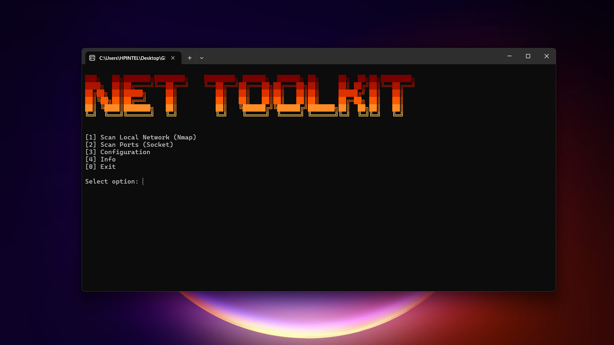
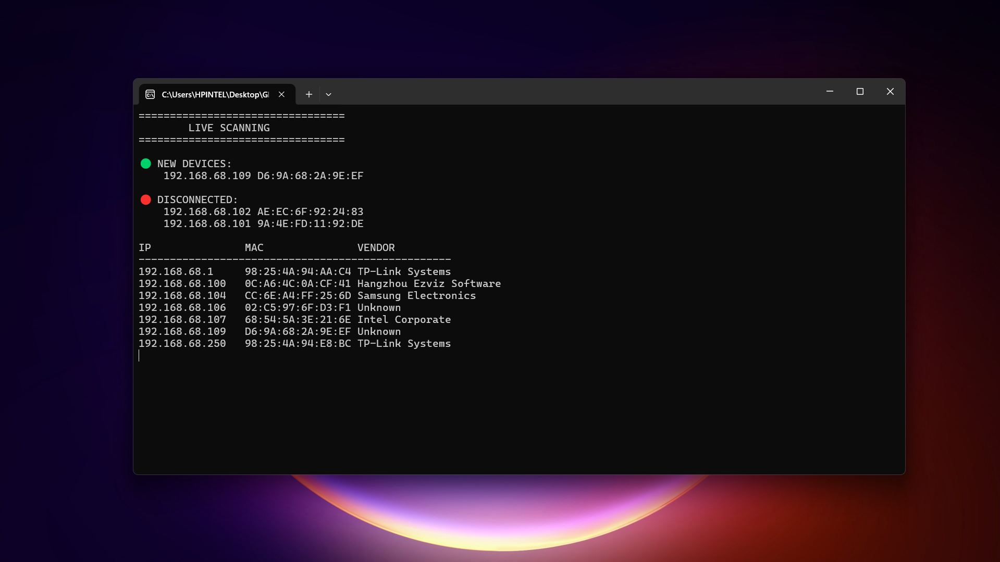
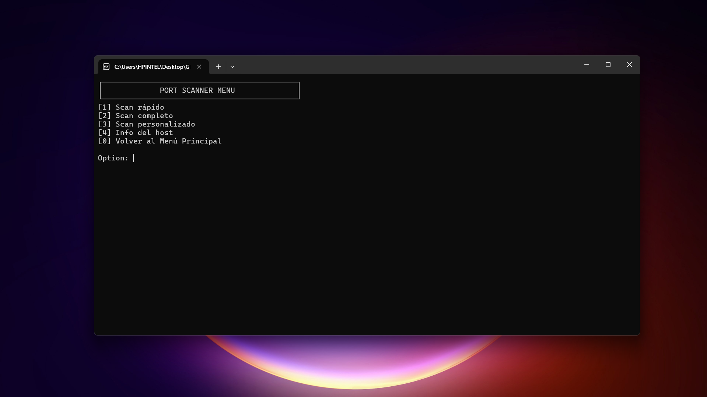
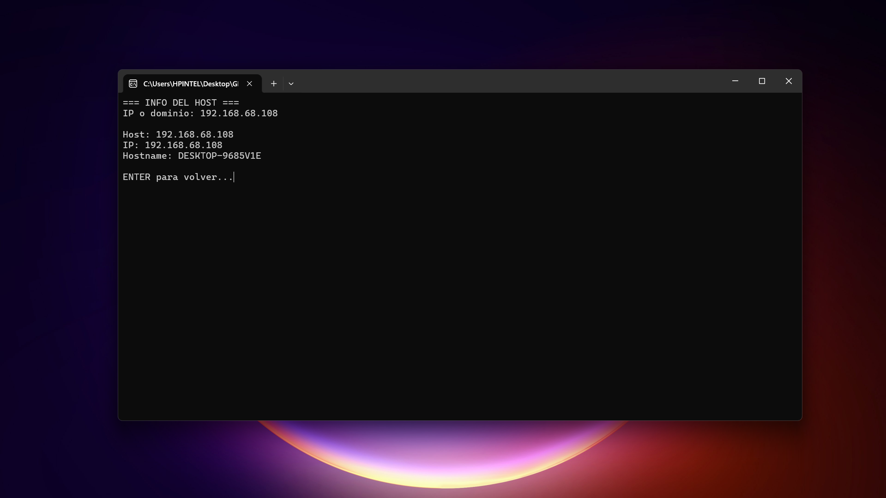
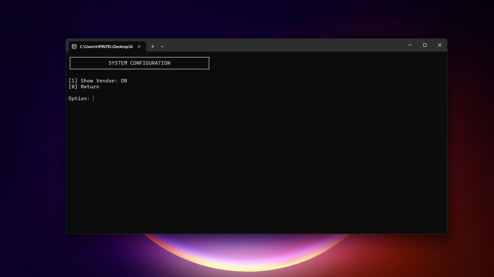

# 🔥 Net Toolkit

---


# 📋 Main Menu

```text
[1] Scan Local Network (Nmap)
[2] Scan Ports (Socket)
[3] Configuration
[4] Info
[0] Exit


```

---

# 📖 Overview

Net Toolkit is a Python-based network analysis utility designed for educational purposes, cybersecurity learning, and network administration.

The project combines multiple networking tools into a single terminal-based application, allowing users to:

* Discover devices connected to a local network
* Monitor network changes in real time
* Scan TCP ports
* Gather host information
* Export network reports
* Analyze network environments efficiently

---

# ✨ Features

## 🌐 Network Scanner

Discover active devices on a local network using Nmap.

### Capabilities

* Device discovery
* IP address detection
* MAC address detection
* Vendor identification
* Network inventory generation
* Report export functionality

### Screenshot


---

## 📡 Live Network Monitoring

Monitor your network continuously and detect changes automatically.

### Capabilities

* New device detection
* Device disconnection alerts
* Automatic refresh every 5 seconds
* Real-time network visibility

### Screenshot




---

## 🔍 Port Scanner

Perform TCP port scans against a target host.

### Scan Modes

#### Fast Scan

Scans the most common ports:

* 22 (SSH)
* 80 (HTTP)
* 443 (HTTPS)
* 3306 (MySQL)
* 8080 (HTTP Alternative)

#### Full Scan

Scans ports:

```text
1 - 1000
```

#### Custom Scan

Allows user-defined port lists.

### Screenshot



---

## 🖥 Host Information

Retrieve basic information about a host.

### Information Collected

* Hostname
* IP Address
* DNS Resolution
* Reverse DNS Lookup

### Screenshot



---

## ⚙ Configuration System

Customize the toolkit behavior.

### Current Options

* Enable Vendor Display
* Disable Vendor Display

### Screenshot



---

# 🛠 Technologies Used

| Technology | Purpose           |
| ---------- | ----------------- |
| Python 3   | Core Application  |
| Socket     | TCP Port Scanning |
| Nmap       | Network Discovery |
| Subprocess | Nmap Automation   |
| Datetime   | Report Generation |
| OS Module  | System Operations |

---

# 📂 Project Structure

```text
Net-Toolkit/
│
├── scanner.py
├── README.md
├── requirements.txt
│
├── reports/
│   └── network_reports
│
└── screenshots/
    ├── banner.png
    ├── network-scanner.png
    ├── live-monitoring.png
    ├── port-scanner.png
    ├── host-info.png
    └── configuration.png
```

---

# 🚀 Installation

## 1. Clone Repository

```bash
git clone https://github.com/YOUR-USERNAME/Net-Toolkit.git
cd Net-Toolkit
```

---

## 2. Install Python

Download Python:

https://www.python.org/downloads/

---

## 3. Install Nmap

Download Nmap:

https://nmap.org/download.html

Supported paths:

```text
C:\Program Files\Nmap\nmap.exe
C:\Program Files (x86)\Nmap\nmap.exe
```

---

# ▶ Usage

Run:

```bash
python scanner.py
```


---

# 📄 Report Export

Network scan results can be exported automatically as:

```text
network_report_YYYY-MM-DD_HH-MM-SS.txt
```

Example:

```text
network_report_2026-06-15_18-34-10.txt
```

---

# 🎯 Purpose

This project was created to:

* Learn networking fundamentals
* Practice Python programming
* Understand TCP/IP communication
* Explore network discovery techniques
* Build a cybersecurity portfolio

---

# ⚠ Disclaimer

This project is intended strictly for educational and authorized network administration purposes.

Only scan networks and systems that you own or have explicit permission to test.

The author is not responsible for any misuse of this software.

---

# 👨‍💻 Author

**Parsos**

Cybersecurity Student & Python Developer

---

# ⭐ Support

If you find this project useful, consider giving it a star on GitHub.
